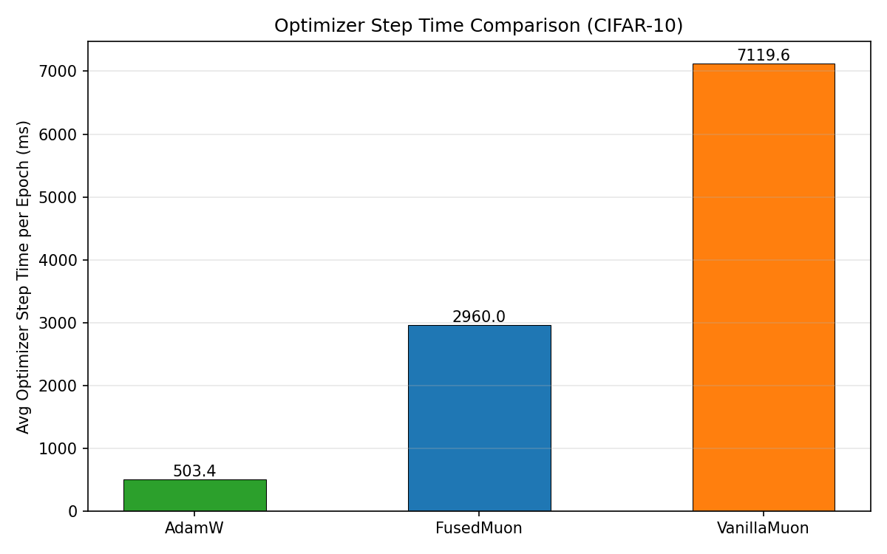
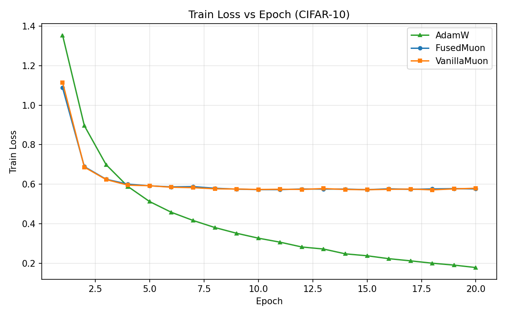
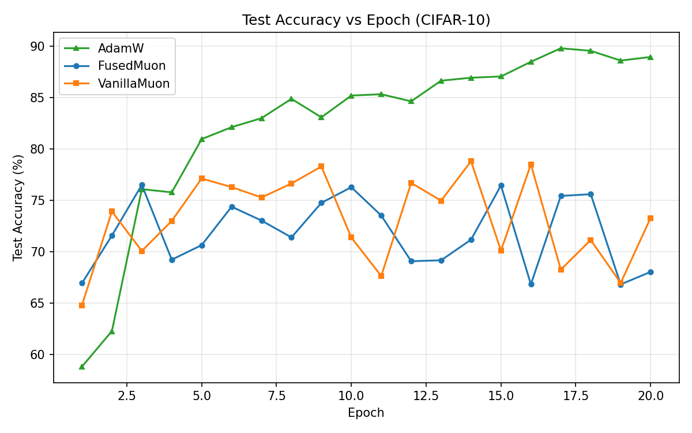
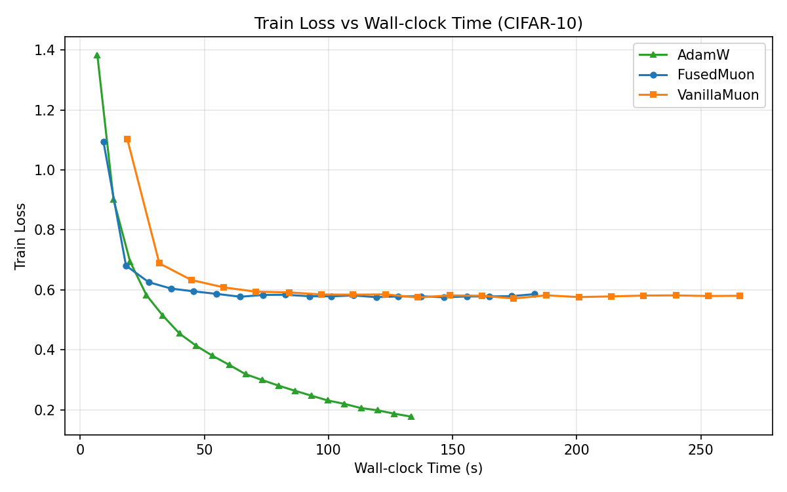

<p align="center">
  <h1 align="center">⚡ fused-muon</h1>
  <p align="center">
    <b>Muon 优化器 Newton-Schulz 迭代的融合 CUDA 内核</b>
  </p>
  <p align="center">
    <a href="https://github.com/StarrickLiu/fused-muon/blob/main/LICENSE"></a>
    <a href="https://github.com/StarrickLiu/fused-muon"></a>
    <a href="https://pytorch.org"></a>
    <a href="https://github.com/StarrickLiu/fused-muon"></a>
  </p>
  <p align="center">
    <a href="#-快速开始">快速开始</a> •
    <a href="#-性能数据">性能数据</a> •
    <a href="#-工作原理">工作原理</a> •
    <a href="README.md">English</a> •
    <a href="docs/optimization_report.md">优化报告</a>
  </p>
</p>

---

[Muon 优化器](https://github.com/KellerJordan/Muon) 的即插即用加速方案。通过自定义 CuTe SYRK 内核利用**矩阵对称性**加速 Newton-Schulz 正交化。NS 迭代速度提升 **1.5 倍**，优化器 step 提升 **2.5 倍**，训练效果**完全一致**。

<p align="center">
  
</p>

## ✨ 核心特性

- 🔺 **SYRK 对称性利用** — `X @ Xᵀ` 结果对称，只计算下三角 → **节省 50% 计算量**
- 🔗 **融合 GEMM Epilogue** — `c·A² + b·A + a·I` 在单个 kernel 中完成，消除 2 次额外 kernel 启动
- 🎯 **自适应调度** — 64/128 tile、Split-K、cuBLAS 回退，根据矩阵形状自动选择
- 🔌 **即插即用 API** — `from muon_fused import FusedMuon`，接口与标准 Muon 完全一致
- 🛡️ **自动回退** — CUDA 扩展不可用时自动退回纯 PyTorch 实现

---

## 🚀 快速开始

### 安装

```bash
git clone --recursive https://github.com/StarrickLiu/fused-muon.git
cd fused-muon
pip install -e .
```

### 使用

```python
from muon_fused import FusedMuon

# 直接替换标准 Muon，API 完全一致
optimizer = FusedMuon(model.parameters(), lr=0.02, momentum=0.95, ns_steps=5)
```

或在自定义优化器中仅使用优化后的 Newton-Schulz 函数：

```python
from muon_fused import fused_newton_schulz

# 替换 zeropower_via_newtonschulz5()
X_ortho = fused_newton_schulz(G, steps=5)
```

---

## 📊 性能数据

### CIFAR-10 训练对比：FusedMuon vs VanillaMuon vs AdamW

<table>
<tr>
<td></td>
<td></td>
</tr>
<tr>
<td></td>
<td></td>
</tr>
</table>

> FusedMuon 和 VanillaMuon 的训练曲线**完全重合**，确认数值等价性。GPU 侧测量（CUDA Event）确认优化器 step 提升 **2.5 倍**，训练迭代提升 **1.42 倍**。

### Newton-Schulz 单步加速（5 次迭代）

测试环境：NVIDIA A800-SXM4-80GB，BF16：

| 矩阵形状 (m, n) | 原版 (ms) | 融合版 (ms) | 加速比 |
|:---:|:---:|:---:|:---:|
| (896, 1152) | 0.58 | 0.31 | **1.87x** |
| (2048, 2560) | 2.26 | 1.44 | **1.57x** |
| (2560, 4096) | 3.57 | 2.36 | **1.51x** |
| (3584, 4608) | 7.93 | 5.26 | **1.51x** |
| (4096, 4096) | 9.58 | 6.30 | **1.52x** |

### 端到端 NS 迭代加速（Qwen 模型权重形状）

| 模型 | 层 | 形状 (m, n) | GEMM1 | GEMM2 | 端到端 |
|:---:|:---:|:---:|:---:|:---:|:---:|
| Qwen 3B | QKV | (2048, 2560) | 1.59x | 1.69x | **1.38x** |
| Qwen3-4B | QKV | (2560, 6144) | 1.72x | 1.64x | **1.32x** |
| Qwen 7B | QKV | (3584, 4608) | 1.67x | 1.78x | **1.38x** |
| Qwen 7B | O | (3584, 3584) | 1.61x | 1.78x | **1.39x** |
| 标准方阵 | — | (4096, 4096) | 1.66x | 1.84x | **1.42x** |

> 全部 19 个测试 shape 均 **≥ 1.03x** 加速。核心 shape（m ≥ 2048，n/m ≤ 4）稳定 **1.31–1.42x**。

---

## 🔬 工作原理

每步 Newton-Schulz 迭代计算：

$$X_{k+1} = \left(aI + bA + cA^2\right) X_k, \quad A = X_k X_k^\top$$

系数 $(a, b, c) = (3.4445, -4.7750, 2.0315)$。分解为 3 个 GEMM：

```
GEMM1: A = X @ Xᵀ           → CuTe SYRK（利用对称性省 50% 计算）
GEMM2: B = c·A² + b·A + a·I → CuTe SYRK + 融合多项式 epilogue（1 个 kernel）
GEMM3: X_new = B @ X         → cuBLAS（标准 GEMM，~80% MFU）
```

### 关键内核优化

| 技术 | 应用位置 | 收益 |
|:---|:---|:---|
| **SYRK 下三角计算** | GEMM1, GEMM2 | 50% 计算量削减 |
| **融合多项式 Epilogue** | GEMM2 | 将 `c·acc + b·A + a·I` 合并入 SYRK kernel |
| **双写 Epilogue** | GEMM1, GEMM2 | 通过 smem 转置输出完整对称矩阵 |
| **BYPASS L1** (`cp.async.cg`) | 所有 SYRK | 避免 L1 cache 污染，**+56% 性能** |
| **Split-K** | GEMM1 (n ≫ m) | 沿 K 维度拆分 block 提升 SM 利用率 |
| **自适应 Tile 选择** | 全部 | 小 m 用 64×64（更多 block），大 m 用 128×128（更高算术强度）|

> 完整的 NCU 分析、寄存器压力分析和优化历程详见 [docs/optimization_report.md](docs/optimization_report.md)。

---

## 📦 高级用法

### 参数分组（推荐用于 LLM 训练）

```python
from muon_fused import FusedMuon

# 2D+ 参数 → Muon（SGD 动量 + NS 正交化）
# 1D 参数（偏置、归一化）→ AdamW 回退
param_groups = [
    {"params": [p for p in model.parameters() if p.ndim >= 2], "use_muon": True},
    {"params": [p for p in model.parameters() if p.ndim < 2], "use_muon": False},
]
optimizer = FusedMuon(param_groups, lr=0.02, momentum=0.95, ns_steps=5)
```

---

## ⚙️ 环境要求

| 依赖 | 版本 |
|:---|:---|
| NVIDIA GPU | **SM80+**（A100, A800, H100, H200）|
| PyTorch | ≥ 2.0 |
| CUDA Toolkit | ≥ 11.8 |
| CUTLASS | 作为 git submodule 包含（仅头文件）|

---

## 🧪 测试

```bash
pytest tests/ -v
```

## 📈 复现 Benchmark

```bash
python benchmarks/bench_ns_step.py     # NS 单步性能分析
python benchmarks/train_cifar10.py     # CIFAR-10 训练对比
python benchmarks/plot_results.py      # 生成曲线图
```

---

## 📚 引用

```bibtex
@software{fused_muon,
  title  = {Fused Muon: CUDA-Optimized Newton-Schulz Iteration for the Muon Optimizer},
  author = {Xingchen Liu},
  year   = {2025},
  url    = {https://github.com/StarrickLiu/fused-muon}
}
```

## 🙏 致谢

- [Muon 优化器](https://github.com/KellerJordan/Muon) by Keller Jordan — 原始 Muon 算法
- [CUTLASS](https://github.com/NVIDIA/cutlass) & [CuTe](https://github.com/NVIDIA/cutlass/tree/main/include/cute) by NVIDIA — Tensor Core 抽象层
- [Moonlight](https://github.com/MoonshotAI/Moonlight) by Moonshot AI — 分布式 Muon 实现参考

## 许可证

[Apache 2.0](LICENSE)
